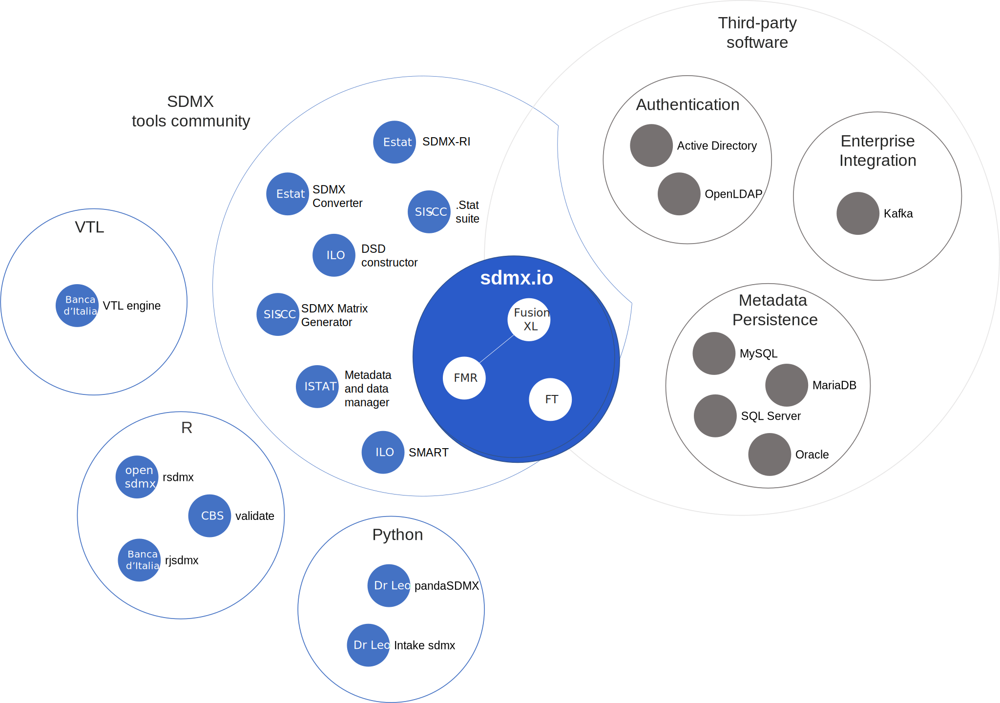

# The sdmx.io tools ecosystem
The sdmx.io ecosystem includes a collection of open source SDMX software tools cooperating to solve official statisics use cases.

# Fusion Metadata Registry (FMR)

Fusion Metadata Registry (FMR) is primarily a **structural metadata registry** - a **database designed specifically for storing SDMX artefacts** including Concepts, Codelists and Data Structure definitions. A **registry** is useful in many cases where statistics are collected, produced and exchanged for externalising, centralising and controlling the structural metadata.

Benefits of using a registry for managing structural metadata include:
- sharing and re-use efficiencies
- standardisation 
- harmonisation of concepts making datasets comparable and consistent
- improved metadata and data governance

FMR provides several additional features in addition to its core registry role that help to support practical use cases: 

Web user interface for creating and maintaining SDMX structure artefacts
: FMR's web user interface provides metadata managers and data modellers with a graphical way to explore the registry's content, create new structures and maintain existing ones.



Many artefacts can also be exported to Excel, modified and reloaded - particularly useful for maintaining large Codelists and Constraints.

Data validation
: Datasets can be loaded and validated - checked that they comply with the 
Checking data quality helps to deliver effective data governance and improves the efficiency of data exchanges, avoiding the costly re-processing or re-transmission.

FMR applies nine standard validation rules:

| **Rule**                     | **Test Applied**                                                               |
| ---------------------------- | ------------------------------------------------------------------------------ | 
| Semantically compliant       | The XML, JSON, CSV or Excel is well formed                                     |
| Duplicate observations       | Uniqueness - there is only one observation value reported for each time period |
| Mandatory attributes         | All mandatory attributes are reported                                          |
| Obs status                   | [OBS_STATUS](https://registry.sdmx.org/ws/public/sdmxapi/rest/codelist/SDMX/CL_OBS_STATUS/2.2) is consistent with the observation value |
| Time period format           | E.g. FREQ=M means the TIME_PERIOD format must be YYYY-MM                       |
| Valid calculations           | Balance equalities defined used Validation Schemes                             |
| Valid constraints            | The data is within the universe defined by *Data Constraints*                  |
| Valid representation         | Each component complies with the *representation* defined in the DSD           |
| Valid structure              | The dimensions and attributes are consistent with the DSD                      |

Conversion of SDMX data between transmission formats
: Datasets can be converted between most SDMX formats including:
- SDMX-ML (XML) 2.0 and 2.1
- SDMX-JSON versions v1 (SDMX 2.1) and v2 (SDMX 3.0)
- SDMX-CSV versions v1 (SDMX 2.1) and v2 (SDMX 3.0)
- EDI
- Excel (note that data worksheets must follow a specific layout)

Data mapping
: Datasets can be mapped (transformed) to different DSDs using SDMX Structure Mapping.

Typical use cases include:
- Data collection - transforming received datasets to the DSDs needed for internal processing
- Data reporting - transforming reporting datasets into the structures specified by the data collector (e.g. IMF SDDS ECOFIN, or Eurosystem NAMAIN for National Accounts)
- Public data dissemination - transforming datasets that use an internal DSD with many dimensions to a simpler DSD suitable for external publication
- Statistics production - harmonising the structure and coding of datasets

[More about FMR](../fmr)

# FusionXL (FXL)
FusionXL is an Excel interface for FMR that compliments and provides an alternative to the web user interface. The following functions are supported:
- **Structure Explorer** - browse the structural metadata and work with artefacts such as Concepts, Codelists and DSDs in Excel worksheets. Create new structures and maintain existing ones, for instance: add new codes to a Codelist.
- **Data Author, Validate**, Convert - create SDMX datasets using helpers to set the correct structure and pick codes. Validate the dataset and convert it to any of the standard SDMX transmission formats including XML, JSON and EDI.



# Fusion Transformer (FT)
Fusion Transformer is a command line application for converting SDMX data between transmission formats. It provides an alternative to the FMR data conversion service finding application in scripts and data processing automation.
