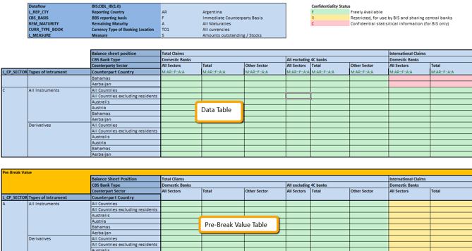

### Webinar

**Fusion Metadata Registry** (FMR) is the free to use SDMX structural metadata registry from the BIS supporting EDI, SDMX 2.0, 2.1 and 3.0. FMR enables official statistics organisations to externalise, centralise and control all SDMX structures including Codelists, Concepts and DSDs with the benefits of maintainability, re-use, standardisation, harmonisation and improved metadata and data governance.

Excel remains a popular choice for managing and exchanging statistical data. For many data providers, reporting their data in an Excel workbook is simple requiring no specialised software, procedures or SDMX expertise. However, the worksheets must follow a specific format to be processable by the data collector. 

**FMR's Excel Templates feature** provides an answer when working with smaller universes of data by generating  **cross-tabulation Excel forms** requiring the data reporter enter just the observation values, and optionally observation attributes. 

### Audience
The webinar is for those concerned with the collection of data from multiple data providers / reporters.

### Learning outcomes
By attending you will learn about:
- Excel Templates principles and use cases
- Where Excel Templates work well, and when to consider other data collection strategies
- Defining an Excel Template using Fusion Metadata Registry's web user interface
- Generating Excel an form from a Template for a specific data provider
- Validating the completed Excel forms and converting to other SDMX formats

More on SDMX at [sdmx.org](https://sdmx.org) .