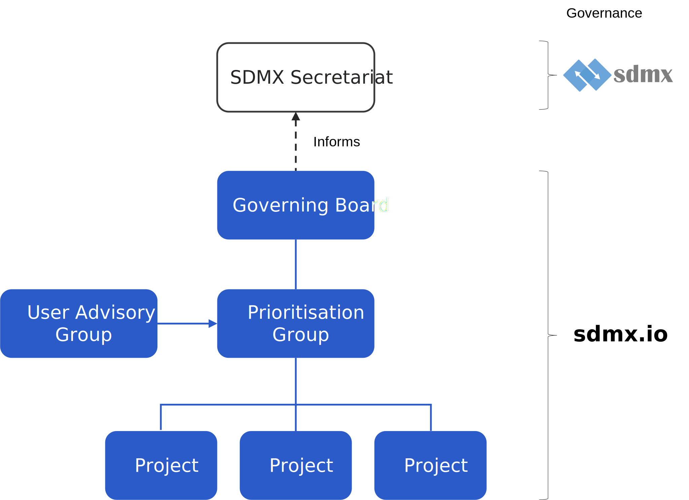

### Governance overview

   

sdmx.io is overseen by the **[Governing Board](../governingboard)** composed of senior representatives of the members and led by the sdmx.io chair.

sdmx.io is not part of the SDMX governance structure but keeps the SDMX Secretariat informed.

The board is responsible for:
- Setting direction
- Policy and strategy approval
- Coordinated sdmx.io roadmap approval
- Comms and marketing plans approval
- Appointment of new members approval
- Financial investment priorities and budget approval
- Funding approval

The **[Prioritisation Group](../prioritisationgroup)** reports to the board and is concerned with coordinating project roadmaps and setting workplan priorities, specifically:
- Identifying user needs
- Ensuring the sdmx.io initiative is ‘doing the right thing’ by focusing effort on the correct priorities
- Coordination of alliance members’ product roadmaps creating an integrated sdmx.io roadmap and avoid duplication of effort
- Maintain a requirements traceability matrix of tools’ functionality against user requirements

The Prioritisation Group takes input from the **Users Advisory Group** which consists of an invited group of business users from central banks, national statistics offices, international organisations, development banks and other classes of official statistics organisations who advise on stakeholder engagement strategies within their respective communities.

### Project governance

**sdmx.io projects** are self-governing and may determine their own governance rules consistent with sdmx.io policies and the open source definition.

### Members
The **sdmx.io members** are participating SDMX Sponsor organisations, plus other organisations who make a signficant contribution to the sdmx.io goals by contributing projects, funding or advocacy.

Founding members

    

